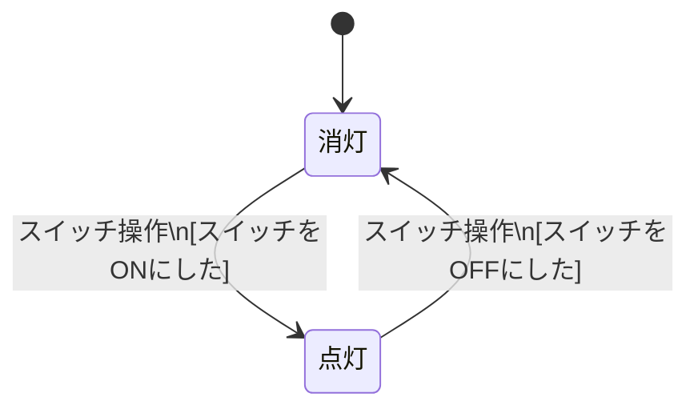

# テストモデル入門

**読了目安：約7分**  
**この資料を読んだら：課題5に進んでください**

---

## 課題1〜4では拾えないバグがある

課題1〜4では「何を入力したか」でテストを設計してきました。

- 有効な値か・無効な値か（同値分割）
- 境界はどこか（境界値分析）
- 条件の組み合わせはどうか（デシジョンテーブル）

これらの技法を使えば、多くのバグを見つけられます。

でも次のテストは、入力値の観点だけでは設計しにくいです。

> 「ログインに1回失敗した後、正しいIDとパスワードを入力したら、ちゃんとログインできるか？」

「正しいIDとパスワード」は有効な入力値です。でも「1回失敗した後」という**状況**は、入力値の観点では表現できません。

こうした「システムが今どんな状態にあるか」という観点でテストを設計するのが**状態遷移テスト**です。

---

## 「状態」という観点

状態遷移テストは3つの要素で考えます。

| 要素 | 意味 | 例（電球） |
|---|---|---|
| **状態** | システムが「今どんな条件にあるか」 | 消灯、点灯 |
| **遷移** | 状態が変化すること | 消灯 → 点灯 |
| **ガード条件（Guard）** | 遷移が起きる条件（慣例として `[ ]` で囲む） | [スイッチをONにした] |

状態を整理すると「このシステムはどういう状況になりうるか」が一覧できます。

---

## 図を先に描く＝モデリング

なぜ先に図を描くのか？　それは、**図を描く作業自体が仕様の穴を見つける**からです。

「この操作のあと、システムはどの状態に戻るんだろう？」  
「この遷移、仕様書に書いてなくない？」

こういった疑問が、図を描こうとした瞬間に浮かびます。テストケースを先に書き始めると、仕様の穴を飛び越えたまま気づかないことがあります。

仕様をテスト設計に使いやすい形（図や表）で表したものを**テストモデル**といい、その作業を**モデリング**といいます。状態遷移図はテストモデルの一例です。

テストモデル → 網羅すべき矢印（**カバレッジアイテム**）→ テストケース、という順で進めることで、「何をテストすべきか」の根拠が論理的に導けます。

---

## Mermaid で状態遷移図を読む

課題5では Claude Code が **Mermaid** という記法で状態遷移図を出力します。

Mermaid は Markdown の中に書けるダイアグラム記法です。VS Code で `Ctrl+Shift+V`（Mac: `Cmd+Shift+V`）を押すとプレビューが開き、コードが図として表示されます。

### 電球の例で読み方を覚える

````

````

このコードをMarkdownファイルに書いてプレビューすると、状態遷移図が表示されます。図には次の要素が含まれます：

- 四角がひとつの**状態**
- 矢印がひとつの**遷移**
- 矢印のラベルが「きっかけ（イベント）」と「`[ ]` で囲んだガード条件」

### 各行の読み方

遷移の行は、1行の中に「矢印」「イベント」「ガード条件」がまとめて書かれています。

| コード | 意味 |
|---|---|
| `[*] --> 消灯` | `[*]` は初期状態（図の開始点）を表す記号。最初の状態は「消灯」 |
| `消灯 --> 点灯` | 「消灯」から「点灯」へ遷移する |
| `: スイッチ操作` | 遷移のきっかけ（イベント） |
| `\n[スイッチをONにした]` | 遷移が起きる条件（ガード条件）。`\n` は改行 |

### 矢印の数 ＝ カバレッジアイテムの数

電球の例には矢印が2本あります。つまりこのシステムには、テストすべき項目（カバレッジアイテム）が2つあります。

テストモデルを先に作ることで、「何をテストすべきか」の一覧が仕様から論理的に導けます。これが課題5で体験する設計の流れです。

---

## この資料を読んだら課題5に進めます

ここまでで次のことを知りました。

- 「状態」「遷移」「ガード条件」の意味
- テストモデルを先に作る理由
- Mermaid の `stateDiagram-v2` コードの読み方

AI が生成した状態遷移図をレビューする準備ができています。**課題5の Step 1 に進みましょう。**
