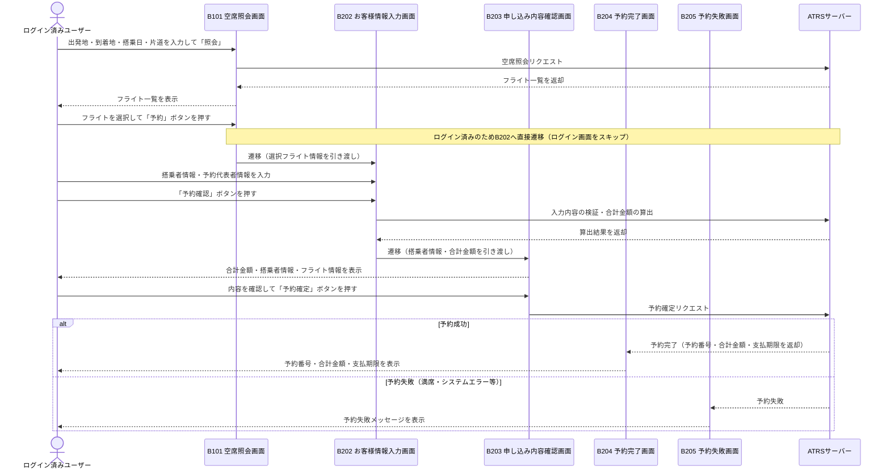

# 課題9 テスト設計

## 1. シーケンス図（テストモデル）

---

## 2. テスト条件一覧

### 有効同値パーティション（正常系）

| # | テスト条件ID | 観点 | 入力条件 | 期待する動作 |
|---|------------|------|---------|-------------|
| 1 | TC-C-V01 | 年齢区分：12歳以上のみ | 搭乗者が全員12歳以上 | 運賃 × 搭乗者数で合計金額を算出する |
| 2 | TC-C-V02 | 年齢区分：12歳未満のみ | 搭乗者が全員12歳未満 | （基本運賃 × 60% − 割引額）× 搭乗者数で算出する |
| 3 | TC-C-V03 | 年齢区分：混在 | 12歳以上と12歳未満が混在 | 大人料金の合計 ＋ 子供料金の合計を加算する |
| 4 | TC-C-V04 | 搭乗者数：1名 | 大人1名のみ | 運賃 × 1 で算出する |
| 5 | TC-C-V05 | 搭乗者数：複数名 | 大人複数名 | 運賃 × 人数で算出する |
| 6 | TC-C-V06 | 端数処理：端数なし | 計算結果が100円の倍数 | 切り上げ処理が発生せず、そのままの金額になる |
| 7 | TC-C-V07 | 端数処理：端数あり | 計算結果に100円未満の端数が生じる | 100円未満を切り上げた金額になる |

### 無効同値パーティション（異常系）

| # | テスト条件ID | 観点 | 入力条件 | 期待する動作 |
|---|------------|------|---------|-------------|
| 8 | TC-C-I01 | 搭乗者数：0名 | 搭乗者数に0を指定 | エラーとなり予約不可（搭乗者なしで予約できない） |
| 9 | TC-C-I02 | 年齢：負の値 | 搭乗者の年齢に負数を入力 | 入力エラーとなり受け付けない |
| 10 | TC-C-I03 | 年齢：数値以外 | 搭乗者の年齢に文字列を入力 | 入力エラーとなり受け付けない |

### 補足：境界値分析の観点（年齢境界）

| 年齢 | 区分 | 適用される料金 |
|------|------|--------------|
| 11歳 | 12歳未満（境界直下） | 子供料金（基本運賃 × 60% − 割引額） |
| 12歳 | 12歳以上（境界値） | 大人料金（運賃） |
| 13歳 | 12歳以上（境界直上） | 大人料金（運賃） |

---

## 3. テストケース表

| テストケースID | 搭乗者の年齢構成 | 期待する合計金額の考え方 |
|--------------|----------------|----------------------|
| TC-F-001 | 大人1名（20歳） | 運賃 × 1 |
| TC-F-002 | 子供1名（5歳） | （基本運賃 × 60% − 割引額）× 1 |
| TC-F-003 | 大人1名（20歳）＋子供1名（5歳） | 運賃 × 1 ＋ （基本運賃 × 60% − 割引額）× 1 |
| TC-F-004 | 大人2名（20歳・30歳） | 運賃 × 2 |
| TC-F-005 | 子供2名（3歳・8歳） | （基本運賃 × 60% − 割引額）× 2 |
| TC-F-006 | 境界直下：子供1名（11歳） | 子供料金が適用される：（基本運賃 × 60% − 割引額）× 1 |
| TC-F-007 | 境界値：大人1名（12歳） | 大人料金が適用される：運賃 × 1 |
| TC-F-008 | 境界直上：大人1名（13歳） | 大人料金が適用される：運賃 × 1 |
| TC-F-009 | 端数なし：大人1名（合計が100円の倍数） | 切り上げ不要：計算値がそのまま合計金額になる |
| TC-F-010 | 端数あり：子供1名（合計に100円未満の端数が生じる） | 100円未満を切り上げた金額が合計金額になる |
