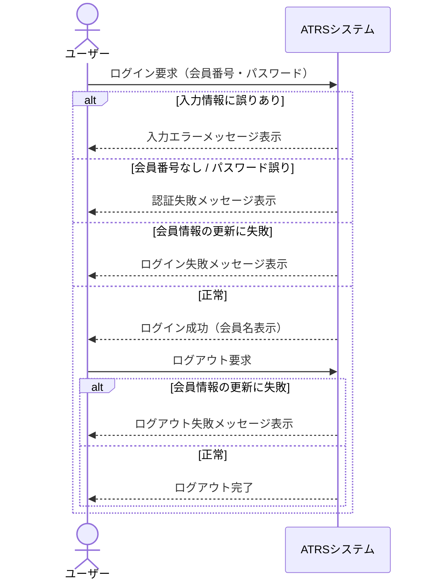

# ログイン機能 テストモデル（シーケンス図）

テストベース：ATRS要件定義書 A03-01（ログインする）・A03-02（ログアウトする）

---

## シーケンス図

---

## カバレッジアイテム（シナリオ）

図を端から端まで辿れるシナリオ数 = **5件**

| # | シナリオ |
|---|---|
| S1 | 入力情報に誤りあり |
| S2 | 会員番号なし / パスワード誤り |
| S3 | ログイン時：会員情報の更新に失敗 |
| S4 | 正常ログイン → ログアウト時：会員情報の更新に失敗 |
| S5 | 正常ログイン → 正常ログアウト |
