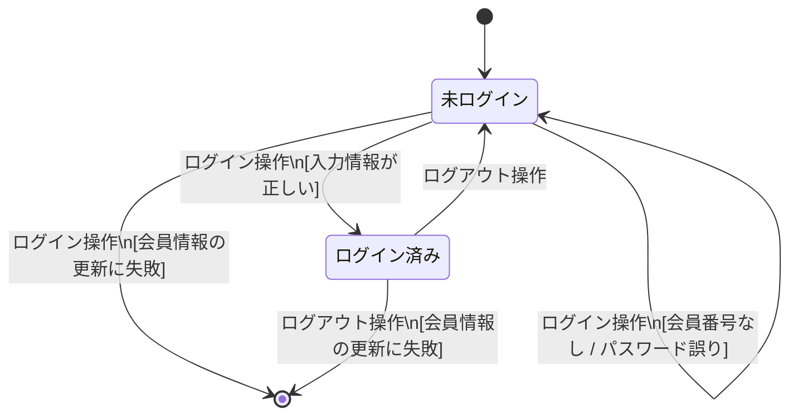

# ログイン機能 テストモデル（状態遷移図）

テストベース：ATRS要件定義書 A03-01（ログインする）・A03-02（ログアウトする）

---

## 状態遷移図

---

## カバレッジアイテム

矢印の数（`[*] -->` を除く）= **6本** → カバレッジアイテム数 = **6**

| # | 遷移の名前 | きっかけ（イベント） | ガード条件 | 開始状態 | 終了状態 |
|---|---|---|---|---|---|
| T1 | 正常ログイン | ログイン操作 | 入力情報が正しい | 未ログイン | ログイン済み |
| T2 | 入力エラー | ログイン操作 | 入力情報に誤りあり | 未ログイン | 未ログイン |
| T3 | 認証失敗 | ログイン操作 | 会員番号なし / パスワード誤り | 未ログイン | 未ログイン |
| T4 | ログイン例外 | ログイン操作 | 会員情報の更新に失敗 | 未ログイン | 終了 |
| T5 | 正常ログアウト | ログアウト操作 | — | ログイン済み | 未ログイン |
| T6 | ログアウト例外 | ログアウト操作 | 会員情報の更新に失敗 | ログイン済み | 終了 |
