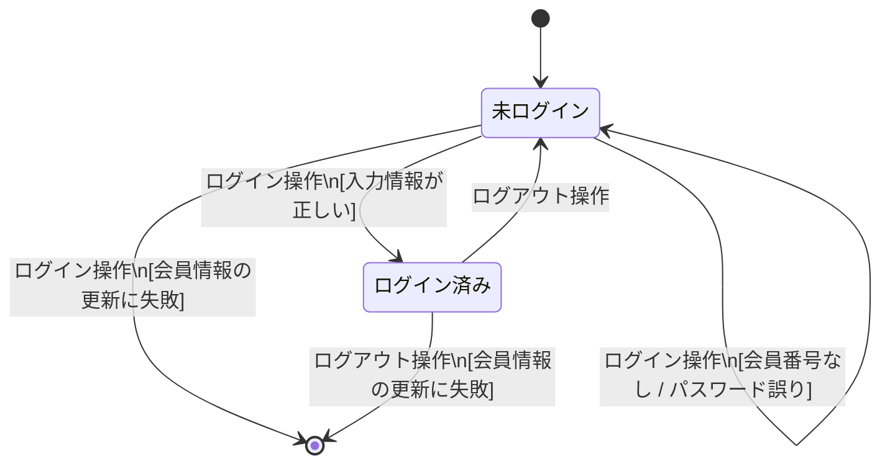

# 課題5：ログイン機能のテストモデルを作る

**所要時間：** 25〜30 分  
**対象：** 課題4を終えた受講者  
**前提：** Claude Code がインストールされていること

---

## この課題の目的

課題1〜4では「**入力値**」の観点でテストを設計しました。  
「有効な値か・無効な値か」「境界はどこか」「条件の組み合わせはどうか」。

この課題では「**状態**」という新しい観点を学びます。  
そして **Claude Code を使ってテストモデルを作り、設計に活用する**体験をします。

> ISO/IEC/IEEE 29119-2:2021 では、テスト設計の最初のステップとして  
> 「テストモデルの作成（TD1）」を定義しています。  
> テストモデルとは、「何を・どの観点で・どこまでテストするかを示した設計の土台」です。  
> 状態遷移図は、同規格がテストモデルの表現形式として明示している例のひとつです。

---

## 状態遷移テストとは

### 「状態」という観点

同値分割法・境界値分析・デシジョンテーブルテストといった仕様ベーステスト技法は「何を入力したか」でテストを分類します。  
状態遷移テストは「**システムが今どんな状態にあるか**」と「**どんな操作をしたか**」でテストを分類します。

たとえばログイン機能を考えたとき、入力値の観点だけでは次の問いに答えにくくなります。

- 「ログイン失敗後にもう一度正しいIDとパスワードを入力したら、ちゃんとログインできるか？」
- 「ログアウト後に再ログインしたら、セッションは正しくリセットされているか？」

これらは「状態の移り変わり（遷移）」を見ないと抜け落ちるテスト観点です。

### 3つの基本要素

| 要素 | 意味 | 例 |
|---|---|---|
| **状態（State）** | システムが「今どんな条件にあるか」 | 未ログイン、ログイン済み |
| **遷移（Transition）** | 状態が変化すること | 未ログイン → ログイン済み |
| **ガード条件（Guard）** | 遷移が起きる条件（状態遷移図の慣例として `[ ]` で囲む） | [入力情報が正しい] |

### カバレッジアイテムとの関係

状態遷移テストの基本カバレッジは「**遷移網羅（全遷移を少なくとも1回通す）**」です。  
図に含まれる矢印の数 = カバレッジアイテムの数、と考えてください。  
テストモデル（図）を先に作ることで、テストの「漏れ」と「根拠」が同時に管理できます。

---

## テストベース（今回の対象）

要件定義書の以下2つのユースケース仕様を使います。

- **A03-01**：航空チケット予約システムにログインする  
  （基本フロー・代替フロー①②・例外フロー①）
- **A03-02**：航空チケット予約システムからログアウトする  
  （基本フロー・例外フロー①）

テストベースの全文は `docs/ATRS/テストベース/ATRS 要件定義書 Markdown版.md` の「A3 ユースケース仕様」を参照してください。

---

## Step 1：仕様を読んで「状態」を書き出す（5分）

テストベース（A03-01・A03-02）を読み、**このシステムが持つ「状態」を名詞で書き出してください。**

> **ヒント：** 電球の例では「消灯」「点灯」が状態です。ログイン機能ではどんな状態がありますか？

遷移やガード条件はまだ書かなくて構いません。状態だけで大丈夫です。  
**目的：** 次の Step で AI が生成した図を自分でレビューするための、最低限の理解を作ります。

---

## Step 2：Claude Code でテストモデルを作る（10分）

Claude Code を起動し、以下のプロンプトをそのままコピーして送ってください。

> **ポイント：** 今回は設計・分析だけを行い、実装は行いません。  
> プロンプトの冒頭に「**コードは書かずに、設計のみ行ってください。**」と添えることで、Claude Code が実装に踏み込まずに分析に集中してくれます。

---

**プロンプト例：**

```
コードは書かずに、設計のみ行ってください。

以下はATRS（航空チケット予約システム）のログイン・ログアウト機能のユースケース仕様です。
この仕様をテストベースとして、Mermaid の stateDiagram-v2 形式で状態遷移図（テストモデル）を作成してください。

以下の点を考慮してください。
- システムが取りうる「状態」を識別してください
- 基本フロー・代替フロー・例外フローをすべて遷移として表現してください
- 遷移のラベルにはきっかけ（イベント）と条件（ガード）を記載してください

---
【ユースケース仕様: ログインする（A03-01）】

概要: ATRSカード会員が航空チケット予約システムにログインする

◆基本フロー
1 ATRSカード会員がログイン情報を入力し、システムにログインを依頼する。
2 システムはATRSカード会員情報を取得し、入力情報をチェックする。
3 システムはATRSカード会員情報（前回ログイン時刻、ログイン状態）を更新する。
4 システムはATRSカード会員情報を取得する。
5 システムは、ログインした会員名を表示する。

◆代替フロー①（基本フロー2で、入力情報に誤りがある場合）
1 システムは入力情報に誤りがある旨を表示する。
2 基本フローの1へ戻る。

◆代替フロー②（基本フロー2で、会員番号が存在しない、またはパスワードが間違っている場合）
1 システムは会員番号が存在しない、またはパスワードが間違っている旨を表示する。
2 基本フローの1へ戻る。

◆例外フロー①（基本フロー3で、ATRSカード会員情報の更新に失敗した場合）
1 システムはログインに失敗した旨を表示する。
2 以降続行不可能。

---
【ユースケース仕様: ログアウトする（A03-02）】

概要: ATRSカード会員が航空チケット予約システムからログアウトする

◆基本フロー
1 ATRSカード会員がシステムにログアウトを依頼する。
2 システムはATRSカード会員情報（ログイン状態）を更新する。

◆例外フロー①（基本フロー2で、ATRSカード会員情報の更新に失敗した場合）
1 システムはログアウトに失敗した旨を表示する。
2 以降続行不可能。
```

---

出力された Mermaid コードを新しい Markdown ファイル（例：`login_test_model.md`）にコピーしてください。  
VS Code で `Ctrl+Shift+V`（Mac: `Cmd+Shift+V`）を押すと Markdown プレビューが開き、Mermaid コードが状態遷移図として表示されます。

---

## Step 3：出力をレビューする（5分）

生成された状態遷移図を見て、以下の2つを確認してください。  
不足があれば追加プロンプトを送って補完してもらいましょう。

1. **図の矢印は何本ありますか？**（初期状態を示す `[*] -->` を除いてカウント）
2. **仕様の各フローはすべて矢印に対応していますか？**

| 確認するフロー | 対応する矢印があるか |
|---|---|
| 基本フロー：正常ログイン | |
| 代替フロー①：入力情報に誤りあり | |
| 代替フロー②：会員番号なし / パスワード誤り | |
| 例外フロー①（ログイン時）：会員情報の更新に失敗 | |
| 基本フロー：正常ログアウト | |
| 例外フロー①（ログアウト時）：会員情報の更新に失敗 | |

---

## Step 4：カバレッジアイテムを AI に出力させる（5分）

Step 3 で確認した状態遷移図をもとに、以下の追加プロンプトを Claude Code に送ってください。

```
この状態遷移図から、カバレッジアイテムの表を作成してください。
列は「# / 遷移の名前 / きっかけ（イベント） / ガード条件 / 開始状態 / 終了状態」としてください。
```

出力された表を `login_test_model.md` に追記してください。

> **気づきポイント：** 「矢印の数 = カバレッジアイテムの数」になっていることに気づきましたか？  
> テストモデルを先に作ることで、「何をテストすべきか」の一覧が仕様から論理的に導出できます。  
> これが ISO 29119 で言う「TD1（テストモデル作成）→ TD2（カバレッジアイテムの特定）」の流れです。

---

## 振り返り

以下の問いに自分なりの言葉で答えてみてください。

1. 課題1〜4では「入力値」を観点にテスト条件を識別しました。今回の「状態遷移」という観点は、何が違いましたか？
2. テストモデル（状態遷移図）を事前に作らなかった場合、どの遷移がテストから漏れやすいと思いますか？
3. AI が生成した図やカバレッジアイテムを「正しい」と判断するために、あなたは何を確認しましたか？

---

## 参考：完成イメージ（テストモデル）

課題中は参照しないでください。  
**自力で出力させ、自力でレビューすることが学習のポイントです。**

<details>
<summary>▶ ヒント（クリックで展開）</summary>

### 状態遷移図

````

````

### カバレッジアイテム

| # | 遷移の名前 | きっかけ | ガード条件 | 開始状態 | 終了状態 |
|---|---|---|---|---|---|
| T1 | 正常ログイン | ログイン操作 | 入力情報が正しい | 未ログイン | ログイン済み |
| T2 | 入力エラー | ログイン操作 | 入力情報に誤りあり | 未ログイン | 未ログイン |
| T3 | 認証失敗 | ログイン操作 | 会員番号なし / パスワード誤り | 未ログイン | 未ログイン |
| T4 | ログイン例外 | ログイン操作 | 会員情報の更新に失敗 | 未ログイン | 終了 |
| T5 | 正常ログアウト | ログアウト操作 | — | ログイン済み | 未ログイン |
| T6 | ログアウト例外 | ログアウト操作 | 会員情報の更新に失敗 | ログイン済み | 終了 |

</details>

---

## Step 5：Gitで成果物を管理する

作成した Markdown ファイル（状態遷移図を含むもの）を Git で記録し、GitHub にプッシュしてください。  
**今回も自力でやってみましょう。詰まったときは[Git操作手順書.md](../学習資料/Git操作手順書.md)を参照してください。**

1. ブランチを作成する（`feature/exercise-5`）
2. `git status` で変更ファイルを確認する
3. ファイルをステージングする（ファイル名を指定して）
4. コミットメッセージを書いてコミットする
5. プッシュする（`git push -u origin feature/exercise-5`）
6. GitHubでPRを作成して `main` にマージする
