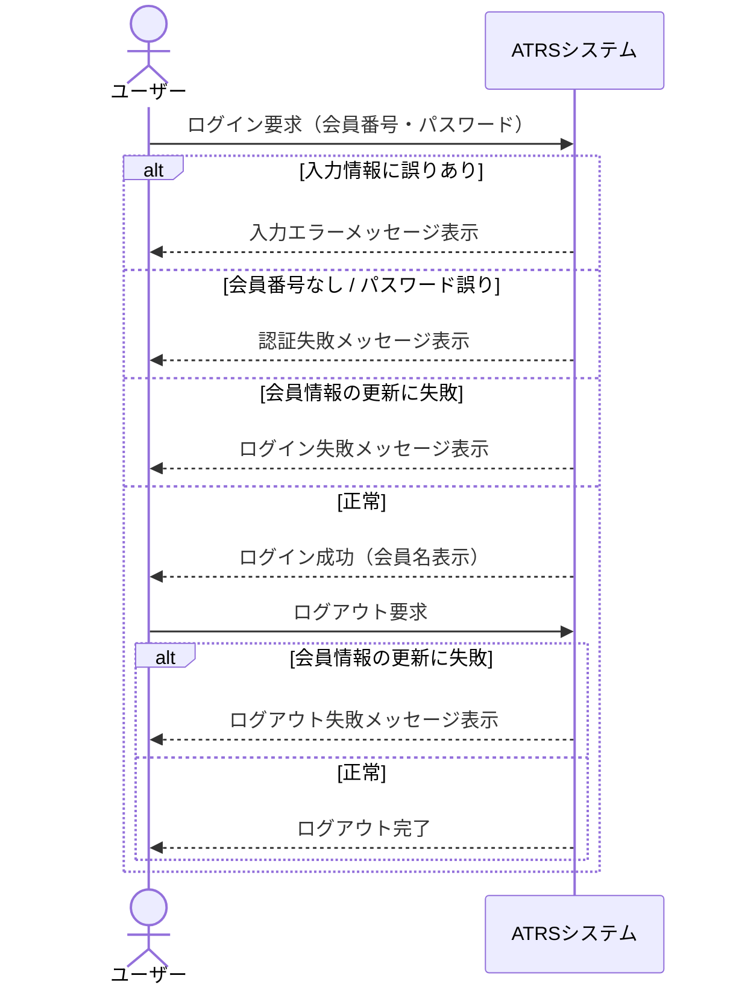

# 課題6：シーケンス図のテストモデルを作る

**所要時間：** 20〜25 分  
**対象：** 課題5を終えた受講者

---

## この課題の目的

課題5では同じログイン仕様から**状態遷移図**を作りました。  
この課題では同じ仕様から**シーケンス図**を作ります。

ひとつの仕様から複数のテストモデルを作れます。そしてモデルの種類が変わると、**見えてくるテストの観点も変わります**。  
状態遷移図と何が違うのか、どんな観点が加わるのかを自分の手で体験してください。

---

## シーケンス図とは

シーケンス図は、複数の参加者が**どんな順番でメッセージを交換するか**を時系列で表した図です。UMLで定義されており、ユースケース仕様の実現を表すために使うのが標準的な活用方法です。

「ユーザーがログイン要求を送る → システムが認証する → システムが結果を返す」のように、要求と応答のやりとりを上から下への時間軸で追えます。

状態遷移図が「システムが今どの状態にいるか」を捉えるのに対し、シーケンス図は「誰が誰とどんな順番でメッセージを交換するか」を捉えます。これにより、応答の抜けや処理順序の誤りを発見しやすくなります。

どちらも「テストモデル」ですが、見えるものが違います。

| モデル | 何を表すか | 何を網羅するか |
|---|---|---|
| 状態遷移図（課題5） | システムが「どの状態にいるか」 | 状態の遷移（矢印） |
| シーケンス図（この課題） | 誰と誰が「どんな順番でメッセージを交換するか」 | メッセージ交換のシナリオ |

---

## この課題で使う3つの概念

| 概念 | 意味 | Mermaid での書き方 |
|---|---|---|
| **ライフライン** | やりとりに参加するアクター・コンポーネント。Mermaid では `actor`（人）または `participant`（システム）で宣言 | `actor ユーザー` / `participant システム` |
| **メッセージ** | ライフライン間のやりとり（`->>` が要求、`-->>` が応答） | `A->>B: メッセージ名` |
| **alt** | 条件によって分岐するシナリオ | `alt 条件` / `else 別の条件` / `end` |

---

## Step 1：Claude Code でシーケンス図を生成する（7分）

Claude Code を起動し、以下のプロンプトをそのままコピーして送ってください。

```
コードは書かずに、設計のみ行ってください。

以下はATRS（航空チケット予約システム）のログイン・ログアウト機能のユースケース仕様です。
この仕様をテストベースとして、Mermaid の sequenceDiagram 形式でシーケンス図（テストモデル）を作成してください。

以下の点を考慮してください。
- 参加者（ライフライン）はアクターとシステムの2者にしてください
- 基本フロー・代替フロー・例外フローをすべて alt/else で表現してください
- メッセージには操作名と内容を記載してください

---
【ユースケース仕様: ログインする（A03-01）】

概要: ATRSカード会員が航空チケット予約システムにログインする

◆基本フロー
1 ATRSカード会員がログイン情報を入力し、システムにログインを依頼する。
2 システムはATRSカード会員情報を取得し、入力情報をチェックする。
3 システムはATRSカード会員情報（前回ログイン時刻、ログイン状態）を更新する。
4 システムはATRSカード会員情報を取得する。
5 システムは、ログインした会員名を表示する。

◆代替フロー①（基本フロー2で、入力情報に誤りがある場合）
1 システムは入力情報に誤りがある旨を表示する。
2 基本フローの1へ戻る。

◆代替フロー②（基本フロー2で、会員番号が存在しない、またはパスワードが間違っている場合）
1 システムは会員番号が存在しない、またはパスワードが間違っている旨を表示する。
2 基本フローの1へ戻る。

◆例外フロー①（基本フロー3で、ATRSカード会員情報の更新に失敗した場合）
1 システムはログインに失敗した旨を表示する。
2 以降続行不可能。

---
【ユースケース仕様: ログアウトする（A03-02）】

概要: ATRSカード会員が航空チケット予約システムからログアウトする

◆基本フロー
1 ATRSカード会員がシステムにログアウトを依頼する。
2 システムはATRSカード会員情報（ログイン状態）を更新する。

◆例外フロー①（基本フロー2で、ATRSカード会員情報の更新に失敗した場合）
1 システムはログアウトに失敗した旨を表示する。
2 以降続行不可能。
```

出力された Mermaid コードを新しいファイル（例：`login_sequence_model.md`）にコピーしてください。  
VS Code で `Ctrl+Shift+V`（Mac: `Cmd+Shift+V`）を押すとシーケンス図が表示されます。

---

## Step 2：出力をレビューする（5分）

生成されたシーケンス図を見て、以下を確認してください。

1. **図を端から端まで辿ると、何通りのシナリオがありますか？**（各シナリオ = カバレッジアイテム1つ）
2. **仕様の各フローはすべていずれかのシナリオに対応していますか？**

| 確認するフロー | 対応するシナリオがあるか |
|---|---|
| 基本フロー：正常ログイン → 正常ログアウト | |
| 代替フロー①：入力情報に誤りあり | |
| 代替フロー②：会員番号なし / パスワード誤り | |
| 例外フロー①（ログイン時）：会員情報の更新に失敗 | |
| 例外フロー①（ログアウト時）：会員情報の更新に失敗 | |

---

## Step 3：Claude Code に Git 操作を依頼する（5分）

課題5では自分で Git コマンドを打ちました。今回は Claude Code に依頼してみましょう。

> **ポイント：** Claude Code はターミナルのコマンドも実行できます。  
> 「〇〇してください」と指示するだけで、適切な Git コマンドを選んで実行してくれます。

以下のプロンプトを送ってください（ファイル名は実際に作成したファイル名に変えてください）。

```
作成したシーケンス図の Markdown ファイルを Git で記録してください。
ブランチ名は feature/exercise-6、コミットメッセージは適切なものを考えてください。
origin へのプッシュと、GitHub で feature/exercise-6 から main へのプルリクエスト作成まで行ってください。
```

Claude Code が実行したコマンドを確認し、課題5で自分で打ったコマンドと同じ手順になっているか見てみましょう。

---

## 振り返り（3分）

課題5（状態遷移図）と比べて、気づいたことを自分の言葉で答えてみてください。

1. シーケンス図では「状態」は出てきましたか？代わりに何が表現されていましたか？
2. 同じ仕様から2種類のモデルを作りました。どちらのモデルが「どんなテストに使いやすい」と思いましたか？

---

## 参考：完成イメージ

課題中は参照しないでください。

<details>
<summary>▶ ヒント（クリックで展開）</summary>



図を端から端まで辿ると、シナリオ（カバレッジアイテム）は5つです。

| # | シナリオ |
|---|---|
| S1 | 入力情報に誤りあり |
| S2 | 会員番号なし / パスワード誤り |
| S3 | ログイン時：会員情報の更新に失敗 |
| S4 | 正常ログイン → ログアウト時：会員情報の更新に失敗 |
| S5 | 正常ログイン → 正常ログアウト |

</details>
